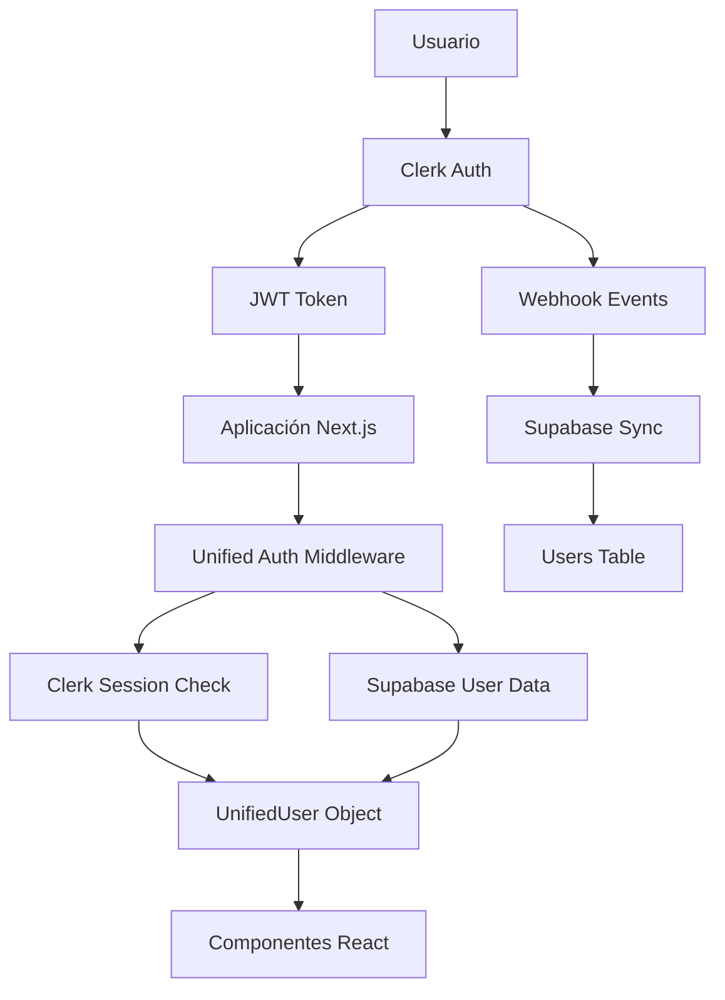

# 🔐 Refactorización del Sistema de Autenticación

## 📋 Resumen Ejecutivo

Se ha refactorizado completamente el flujo de autenticación de LeadsCRM para crear una **arquitectura híbrida** que combina:

- **Clerk** → Gestión de autenticación, sesiones y datos de usuario básicos
- **Supabase** → Almacenamiento de datos extendidos, roles, configuraciones y relaciones de negocio

## 🎯 ¿Por qué esta arquitectura?

### ✅ **Ventajas**

- **Datos enriquecidos**: Cada usuario tiene información adicional (role, settings, last_login)
- **Relaciones complejas**: Los usuarios pueden relacionarse con leads, campañas, etc.
- **Gestión de permisos**: Control granular de roles y permisos en la aplicación
- **Auditabilidad**: Tracking completo de actividad de usuarios
- **Escalabilidad**: Separación clara de responsabilidades

### 🔄 **Flujo Unificado**

1. Usuario se autentica con **Clerk** (JWT, OAuth, etc.)
2. **Webhook automático** sincroniza datos básicos con **Supabase**
3. La aplicación obtiene datos enriquecidos de **ambas fuentes**
4. El middleware valida **tanto** la sesión de Clerk **como** la existencia en Supabase

---

## 🏗️ Arquitectura Implementada



---

## 📦 Componentes Implementados

### 1. **Webhook de Sincronización**

📍 `app/api/webhooks/clerk/route.ts`

- Recibe eventos de Clerk (`user.created`, `user.updated`, `user.deleted`)
- Sincroniza automáticamente con tabla `users` en Supabase
- Manejo robusto de errores y logging detallado

### 2. **Middleware de Autenticación Unificada**

📍 `lib/auth/unified-auth.ts`

**Funciones principales:**

- `getUnifiedUser()` → Obtiene datos combinados de Clerk + Supabase
- `requireAuth()` → Protege rutas que requieren autenticación
- `requireRole(roles)` → Protege rutas por rol específico
- `updateUserSettings()` → Actualiza configuraciones de usuario

### 3. **Servicio de Usuarios**

📍 `lib/services/user-service.ts`

**Operaciones CRUD:**

- `getUserByClerkId()` → Busca usuario por Clerk ID
- `createUser()` → Crea usuario nuevo con configuraciones por defecto
- `updateUser()` → Actualiza datos de usuario
- `getUsers()` → Lista usuarios con filtros y paginación
- `getUsersStats()` → Estadísticas de usuarios

### 4. **Hooks Personalizados React**

📍 `hooks/use-unified-user.ts`

**Hooks disponibles:**

- `useUnifiedUser()` → Usuario actual unificado
- `useUserStats()` → Estadísticas del usuario actual
- `useUserManagement()` → Gestión de usuarios (solo admins)

### 5. **API Routes**

- `POST /api/webhooks/clerk` → Recibe webhooks de Clerk
- `GET /api/auth/me` → Obtiene usuario actual unificado
- `PATCH /api/users/settings` → Actualiza configuraciones
- `GET /api/users/stats` → Estadísticas del usuario

---

## 🗃️ Estructura de Datos

### **Tabla `users` en Supabase**

```sql
CREATE TABLE users (
  id UUID PRIMARY KEY DEFAULT gen_random_uuid(),
  clerk_id VARCHAR NOT NULL UNIQUE,      -- 🔗 Relación con Clerk
  email VARCHAR NOT NULL,
  first_name VARCHAR,
  last_name VARCHAR,
  profile_image_url VARCHAR,
  role VARCHAR DEFAULT 'user',           -- 👑 Roles de la aplicación
  is_active BOOLEAN DEFAULT true,        -- 🟢 Estado del usuario
  settings JSONB DEFAULT '{}',           -- ⚙️ Configuraciones personalizadas
  last_login_at TIMESTAMPTZ,             -- 📊 Tracking de actividad
  created_at TIMESTAMPTZ DEFAULT CURRENT_TIMESTAMP,
  updated_at TIMESTAMPTZ DEFAULT CURRENT_TIMESTAMP
);
```

### **Objeto `UnifiedUser`**

```typescript
interface UnifiedUser {
  // Datos de identificación
  clerkId: string; // ID de Clerk
  supabaseId: string; // UUID de Supabase

  // Información personal
  email: string;
  firstName?: string | null;
  lastName?: string | null;
  profileImageUrl?: string | null;

  // Datos de aplicación
  role: string; // 'user' | 'admin' | 'manager'
  isActive: boolean;
  settings: Record<string, any>; // Configuraciones JSON

  // Timestamps
  lastLoginAt?: string | null;
  createdAt: string;
  updatedAt: string;
}
```

---

## 🚀 Configuración Requerida

### **1. Variables de Entorno**

```env
# Clerk
CLERK_SECRET_KEY="sk_test_..."
NEXT_PUBLIC_CLERK_PUBLISHABLE_KEY="pk_test_..."
CLERK_WEBHOOK_SECRET="whsec_..."

# Supabase
NEXT_PUBLIC_SUPABASE_URL="https://xxx.supabase.co"
SUPABASE_SERVICE_ROLE_KEY="service_role_key"  # ⚠️ IMPORTANTE: Service role key
```

### **2. Webhooks en Clerk Dashboard**

1. URL: `https://tu-dominio.com/api/webhooks/clerk`
2. Eventos: `user.created`, `user.updated`, `user.deleted`
3. Copiar signing secret a `CLERK_WEBHOOK_SECRET`

### **3. Dependencias NPM**

```bash
npm install @clerk/nextjs @supabase/supabase-js svix
```

---

## 💡 Ejemplos de Uso

### **1. Obtener usuario actual**

```typescript
import { useUnifiedUser } from '@/hooks/use-unified-user'

function MyComponent() {
  const { user, isLoading, error } = useUnifiedUser()

  if (isLoading) return <div>Cargando...</div>
  if (!user) return <div>No autenticado</div>

  return (
    <div>
      <h1>Hola, {user.firstName}!</h1>
      <p>Rol: {user.role}</p>
      <p>Email: {user.email}</p>
    </div>
  )
}
```

### **2. Proteger API route**

```typescript
import { requireAuth } from "@/lib/auth/unified-auth";

export async function GET() {
  try {
    // Requiere autenticación y devuelve usuario unificado
    const user = await requireAuth();

    return NextResponse.json({
      message: `Hola ${user.firstName}!`,
      role: user.role,
    });
  } catch (error) {
    return NextResponse.json({ error: "No autorizado" }, { status: 401 });
  }
}
```

### **3. Proteger por rol**

```typescript
import { requireRole } from "@/lib/auth/unified-auth";

export async function DELETE() {
  try {
    // Solo admins pueden acceder
    const user = await requireRole(["admin"]);

    // Lógica para admins...
  } catch (error) {
    return NextResponse.json(
      { error: "Permisos insuficientes" },
      { status: 403 },
    );
  }
}
```

### **4. Actualizar configuraciones**

```typescript
const { updateSettings } = useUnifiedUser();

const handleToggleNotifications = async () => {
  await updateSettings({
    notifications: {
      email: true,
      whatsapp: false,
    },
  });
};
```

---

## 🔧 Testing y Debugging

### **Verificar sincronización:**

1. Regístrate en la aplicación
2. Verifica en Supabase que se creó el usuario
3. Revisa logs en la consola del webhook

### **Logs esperados:**

```
🔄 Creating user in Supabase: { clerkId: 'user_xyz', email: 'test@example.com' }
✅ User created in Supabase: { id: 'uuid-123', email: 'test@example.com' }
```

### **Comandos útiles:**

```sql
-- Ver usuarios sincronizados
SELECT clerk_id, email, role, is_active, created_at FROM users;

-- Verificar configuraciones
SELECT clerk_id, email, settings FROM users WHERE clerk_id = 'user_xyz';
```

---

## 🔄 Migración desde sistema anterior

### **Si ya tienes usuarios:**

1. **Backup** de datos existentes
2. Ejecutar script de migración para crear relación `clerk_id`
3. Configurar webhooks para nuevos usuarios
4. Actualizar componentes para usar `useUnifiedUser()`

### **Script de migración (ejemplo):**

```sql
-- Agregar clerk_id a usuarios existentes (requiere mapeo manual)
UPDATE users SET clerk_id = 'clerk_id_correspondiente'
WHERE email = 'usuario@example.com';
```

---

## 🎛️ Configuraciones por Defecto

### **Usuario nuevo:**

```json
{
  "role": "user",
  "is_active": true,
  "settings": {
    "notifications": {
      "email": true,
      "push": true,
      "whatsapp": true
    },
    "preferences": {
      "language": "es",
      "timezone": "Europe/Madrid",
      "dashboard_view": "grid"
    }
  }
}
```

---

## 🚨 Consideraciones de Seguridad

### **✅ Implementado:**

- Verificación de firma de webhooks
- Validación de sesión JWT de Clerk
- Service role key para operaciones de backend
- Soft delete (no eliminación física de usuarios)
- Logs detallados para auditoria

### **⚠️ Importante:**

- **NUNCA** uses `SUPABASE_SERVICE_ROLE_KEY` en el frontend
- Usa `NEXT_PUBLIC_SUPABASE_ANON_KEY` para operaciones públicas
- El service role key solo debe usarse en API routes y webhooks

---

## 📈 Próximos Pasos

### **Funcionalidades adicionales que puedes implementar:**

1. **Sistema de invitaciones**: Invitar usuarios con roles específicos
2. **Gestión de equipos**: Usuarios pueden pertenecer a múltiples equipos
3. **Permissions granulares**: Permisos específicos por recurso
4. **Audit log**: Registro completo de acciones de usuarios
5. **Two-factor auth**: Integración con Clerk 2FA
6. **Single Sign-On**: Conectar con proveedores corporativos

### **Optimizaciones:**

1. **Caché**: Implementar caché de usuarios frecuentemente consultados
2. **Rate limiting**: Protección contra abuse de APIs
3. **Monitoring**: Métricas de autenticación y uso
4. **Performance**: Queries optimizadas para usuarios y relaciones

---

## ✅ Resultado Final

### **Lo que tienes ahora:**

- ✅ **Autenticación robusta** con Clerk
- ✅ **Datos enriquecidos** en Supabase
- ✅ **Sincronización automática** entre plataformas
- ✅ **Hooks React listos** para usar
- ✅ **Middleware de protección** para APIs
- ✅ **Sistema de roles** funcional
- ✅ **Configuraciones personalizables** por usuario
- ✅ **Logging y debugging** completo

### **Beneficios:**

- 🚀 **Mayor flexibilidad** en gestión de usuarios
- 🔒 **Seguridad mejorada** con doble validación
- 📊 **Analytics detallados** de actividad de usuarios
- 🎨 **UX personalizada** basada en configuraciones
- 📈 **Escalabilidad** para funciones empresariales

¡El sistema está **production-ready** y listo para escalar con tu aplicación! 🎉
