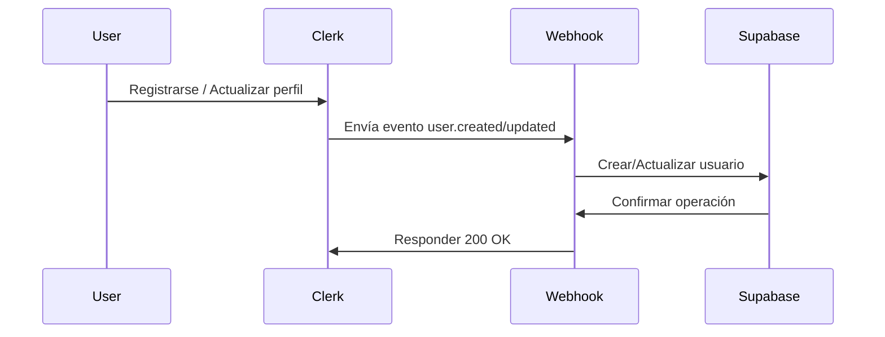

# Configuración de Webhooks de Clerk

## 🎯 Objetivo

Configurar webhooks en Clerk para sincronizar automáticamente los usuarios entre Clerk y Supabase cuando ocurran eventos de usuario.

## 📋 Eventos que manejamos

- `user.created`: Cuando se registra un nuevo usuario
- `user.updated`: Cuando se actualiza la información del usuario 
- `user.deleted`: Cuando se elimina/desactiva un usuario

## 🚀 Configuración en Clerk Dashboard

### Paso 1: Acceder a Webhooks
1. Ve a tu [Clerk Dashboard](https://dashboard.clerk.dev)
2. Selecciona tu aplicación
3. Ve a **Webhooks** en el menú lateral

### Paso 2: Crear un nuevo Webhook
1. Haz clic en **+ Add endpoint**
2. Configura la URL del webhook:
   ```
   https://tu-dominio.com/api/webhooks/clerk
   ```
   - Para desarrollo local: `https://tu-ngrok-url.ngrok.io/api/webhooks/clerk`
   - Para producción: `https://tu-dominio.com/api/webhooks/clerk`

### Paso 3: Seleccionar Eventos
Marca los siguientes eventos:
- ✅ `user.created`
- ✅ `user.updated` 
- ✅ `user.deleted`

### Paso 4: Configurar el Secret
1. Copia el **Signing Secret** que aparece después de crear el webhook
2. Añádelo a tus variables de entorno:
   ```env
   CLERK_WEBHOOK_SECRET="whsec_tu_secret_aqui"
   ```

## 🔧 Variables de Entorno Requeridas

Asegúrate de tener estas variables en tu `.env.local`:

```env
# Clerk Configuration
CLERK_SECRET_KEY="sk_test_o_sk_live_..."
NEXT_PUBLIC_CLERK_PUBLISHABLE_KEY="pk_test_o_pk_live_..."
CLERK_WEBHOOK_SECRET="whsec_tu_webhook_secret"

# Supabase Configuration (necesario para el webhook)
NEXT_PUBLIC_SUPABASE_URL="https://tu-proyecto.supabase.co"
SUPABASE_SERVICE_ROLE_KEY="tu_service_role_key"
```

## 📡 Endpoint del Webhook

El webhook está implementado en:
```
apps/dashboard/app/api/webhooks/clerk/route.ts
```

### Funcionalidades:
- **Verificación de firma**: Valida que el webhook venga de Clerk
- **Manejo de errores**: Logging detallado y respuestas apropiadas
- **Sincronización automática**: Crea/actualiza usuarios en Supabase
- **Soft delete**: Desactiva usuarios en lugar de eliminarlos

## 🧪 Testing en Desarrollo Local

### 1. Usar ngrok para exponer localhost
```bash
# Instalar ngrok si no lo tienes
npm install -g ngrok

# Exponer puerto 3000 (donde corre tu app Next.js)
ngrok http 3000
```

### 2. Configurar webhook con URL de ngrok
En Clerk Dashboard, usa la URL de ngrok:
```
https://tu-random-id.ngrok.io/api/webhooks/clerk
```

### 3. Probar eventos
1. Regístrate como nuevo usuario en tu app
2. Actualiza tu perfil 
3. Ve los logs en tu consola para verificar que los webhooks funcionan

## 🔍 Logs y Debugging

### Logs que deberías ver:
```
🔄 Creating user in Supabase: { clerkId: 'user_xyz', email: 'user@example.com' }
✅ User created in Supabase: { id: 'uuid', email: 'user@example.com' }
```

### Errores comunes:
1. **401 Unauthorized**: Secret de webhook incorrecto
2. **400 Bad Request**: Payload inválido o headers faltantes
3. **500 Internal Server Error**: Error en la base de datos

## 📊 Flujo de Sincronización



## 🛡️ Seguridad

### Verificación de firma:
El webhook verifica automáticamente que los requests vengan de Clerk usando el signing secret.

### Manejo de datos:
- Solo se sincronizan datos básicos del usuario
- Los datos sensibles permanecen en Clerk
- Se aplican configuraciones por defecto seguras

## 🔄 Reintentos

Clerk automáticamente reintenta webhooks fallidos:
- Hasta 5 intentos
- Con backoff exponencial
- Durante 7 días

Para depuración, puedes ver los intentos en el Clerk Dashboard.

## 📝 Estructura del Usuario en Supabase

Después de la sincronización, el usuario tendrá:

```sql
{
  "id": "uuid-generado-por-supabase",
  "clerk_id": "user_clerk_id", 
  "email": "usuario@example.com",
  "first_name": "Juan",
  "last_name": "Pérez", 
  "profile_image_url": "https://img.clerk.dev/...",
  "role": "user",
  "is_active": true,
  "settings": {
    "notifications": {
      "email": true,
      "push": true, 
      "whatsapp": true
    },
    "preferences": {
      "language": "es",
      "timezone": "Europe/Madrid",
      "dashboard_view": "grid"
    }
  },
  "created_at": "2023-12-01T10:00:00Z",
  "updated_at": "2023-12-01T10:00:00Z"
}
```

## 🚀 Despliegue a Producción

### 1. Actualizar URL del webhook
Cambia la URL en Clerk Dashboard a tu dominio de producción:
```
https://tu-dominio.com/api/webhooks/clerk
```

### 2. Variables de entorno
Asegúrate de que las variables de entorno estén configuradas en tu servicio de hosting.

### 3. Logs de producción
Monitorea los logs para asegurar que la sincronización funciona correctamente.

## ❓ Troubleshooting

### Webhook no se ejecuta:
1. Verifica que la URL sea accesible públicamente
2. Revisa que los eventos estén seleccionados en Clerk
3. Verifica el signing secret

### Usuario no se crea en Supabase:
1. Verifica las credenciales de Supabase
2. Revisa los logs de errores en la consola
3. Verifica que la tabla `users` exista y tenga los campos correctos

### Errores de autenticación:
1. Verifica que `SUPABASE_SERVICE_ROLE_KEY` esté configurado
2. Asegúrate de usar la clave de servicio (no la anon key)

Para más ayuda, revisa los logs detallados en el endpoint del webhook.
