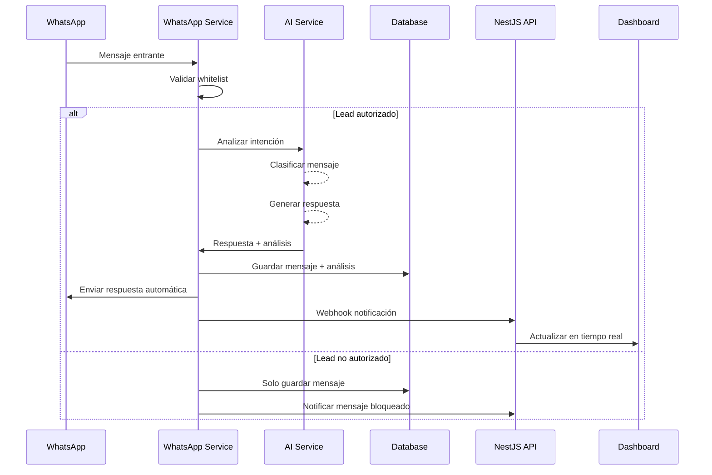
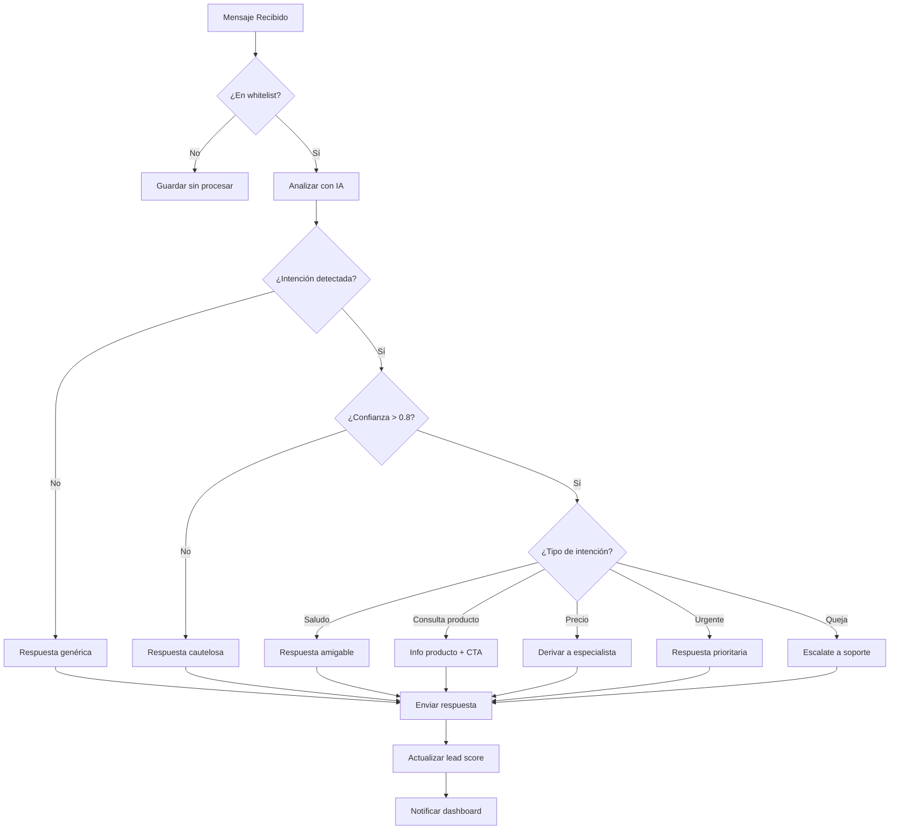
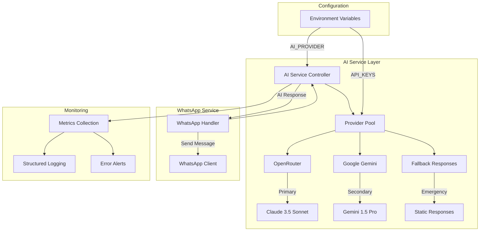
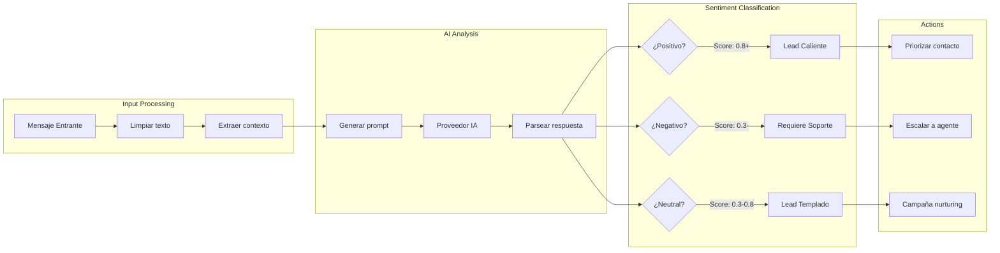
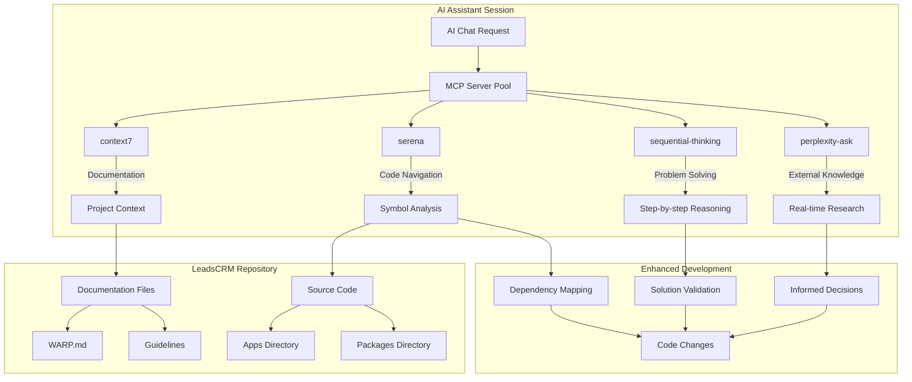
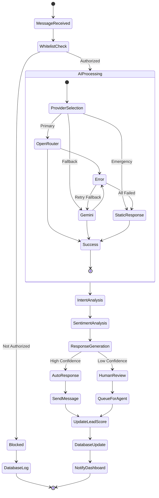
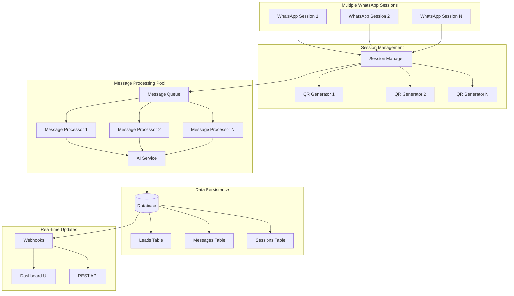
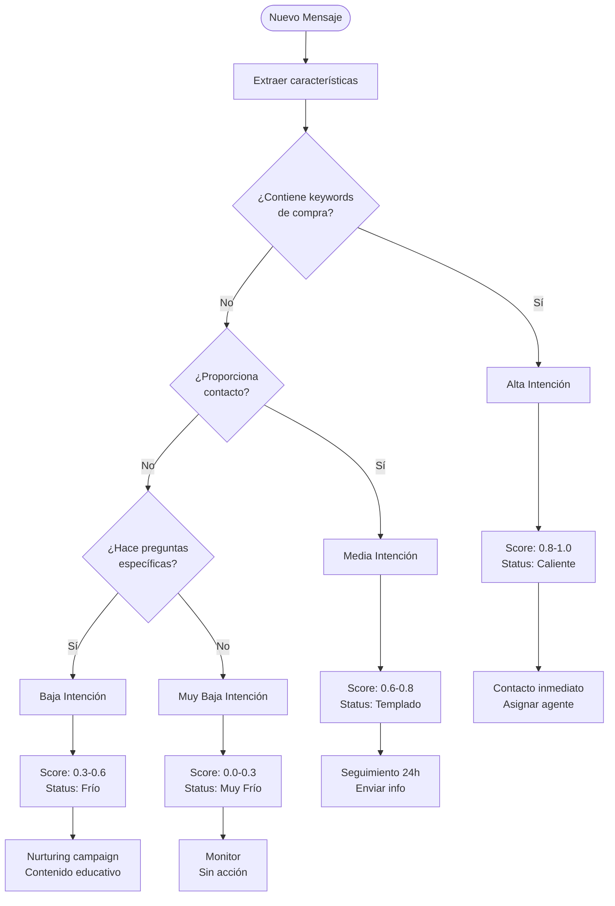
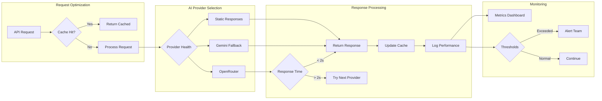
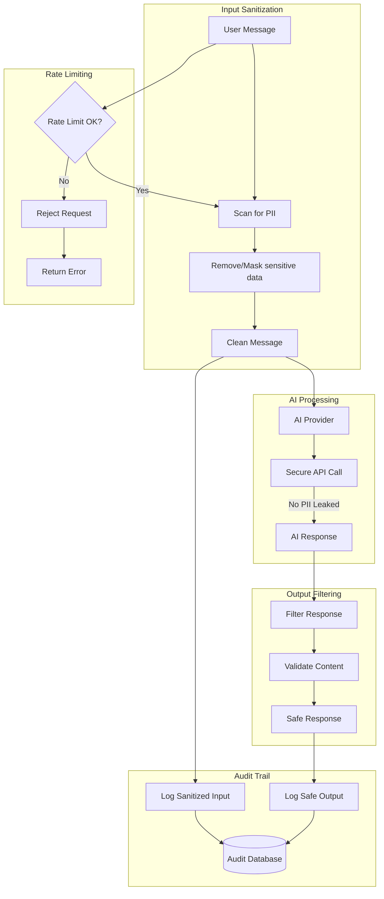

# Architecture Diagrams - LeadsCRM

## 🏗️ Diagramas de Arquitectura y Flujos

Esta documentación visual explica los flujos de datos y arquitectura del sistema LeadsCRM.

## 📊 Flujo de Procesamiento de Mensajes IA

## 🎯 Árbol de Decisión de Auto-Respuestas

## 🔄 Integración de Proveedores IA

## 📈 Flujo de Análisis de Sentimiento

## 🌐 Arquitectura MCP Integration

## 🔄 Workflow de Automatización

## 📊 Flujo de Datos Multi-Sesión WhatsApp

## 🔍 Clasificación de Leads - Decision Tree

## ⚡ Performance Optimization Flow

## 🔒 Security & Privacy Flow

Estos diagramas proporcionan una visión completa de los flujos y arquitectura del sistema LeadsCRM, desde el procesamiento de mensajes hasta la integración MCP y optimización de performance.
